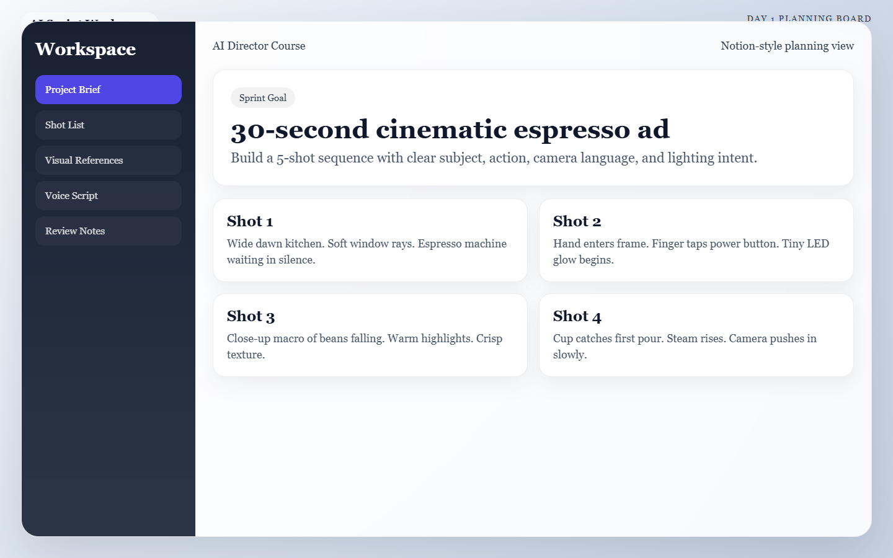
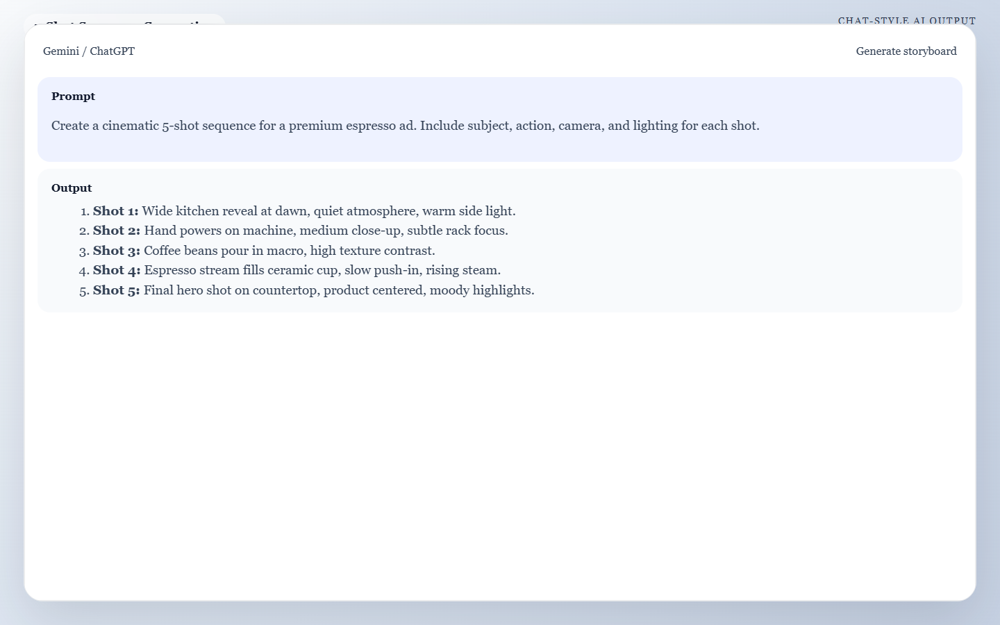

<div class="language-switcher" role="group" aria-label="Language selector">
  <button type="button" class="language-switcher__button is-active" data-language-target="en" aria-pressed="true">English</button>
  <button type="button" class="language-switcher__button" data-language-target="ar" aria-pressed="false">العربية</button>
</div>

<div class="language-panel" data-language-panel="en" markdown="1">

# Day 1: The Director's Blueprint

This is the day you stop thinking in vague ideas and start thinking like a director. Your goal is to leave with a 5-shot plan strong enough that every tool you use later has clear instructions to follow.

!!! success "Today's Mission"
    Create a precise 5-shot storyboard that defines your subject, action, camera language, and lighting intent. By the end of today, you will have a rock-solid blueprint so your AI tools have strict rules to follow tomorrow.

## What You Need Before You Start
* **One simple concept:** An idea that can be shown clearly in under 60 seconds.
* **A rough goal:** Decide if this is a product ad, a brand teaser, or a portfolio piece.
* **A workspace:** One place to save your notes, prompts, and asset decisions (like Notion, a Word doc, or a dedicated notebook).



*Caption: A clean Day 1 planning workspace that keeps the concept, shot list, and project notes in one place before prompting the AI assistant.*

---

## 🏃‍♂️ The Fast Track

If you are ready to move quickly, follow these 4 steps to lock in your storyboard.

### Step 1 — Lock the concept in one sentence
Choose one idea that can survive simplification. Use this exact sentence structure:

* **Format:** This video shows `[subject]` moving through `[situation]` to create `[emotion or outcome]` for `[audience]`.
* **Example:** *This video shows a sea turtle moving through plastic-polluted water to create urgency and compassion for viewers who care about ocean protection.*

### Step 2 — Decide the job of the video
Pick **one** primary goal:
1. Sell a product.
2. Reveal a brand mood.
3. Show off a cinematic idea.

!!! warning "Do not mix goals"
    If you try to do all three equally, your storyboard will become vague. Pick one focus and commit to it.

### Step 3 — Generate your 5-Shot Arc
We are going to use an AI assistant (like Gemini or ChatGPT) to do the heavy lifting of breaking your idea into a cinematic sequence. 

Copy the prompt below, fill in your specific details inside the brackets, and paste it into your AI assistant.

!!! tip "Copy & Paste this Prompt"
    
    ```text
    Act as a professional cinematic storyboard artist and commercial director. I am creating a 30-to-60-second AI-generated video. 

    My concept is: [INSERT YOUR 1-SENTENCE CONCEPT HERE]
    My video goal is: [e.g., A product ad / A mood piece]
    My target audience is: [e.g., People who care about ocean conservation]

    Break this concept down into a strict 5-shot sequence. The sequence must escalate toward a strong final payoff shot. 
    
    For each shot, provide a clear, bulleted list with:
    - Shot Number & Role (Hook, Context, Detail, Escalation, Payoff)
    - Subject (Keep this identity consistent across all shots)
    - Action occurring in the frame
    - Camera Framing & Movement Intent
    - Lighting & Environment details
    - Continuity Notes (What MUST stay exactly the same on Day 2)
    ```



*Caption: Example AI output that turns a one-sentence concept into a structured 5-shot sequence with escalating visual roles.*

### Step 4 — Save the Blueprint
Review the AI's output. Does it make sense? Does the final shot hit hard? Once you are happy with it, copy the sequence into your workspace. 

---

## 🧠 The Deep Dive

Expand these sections to understand the "why" behind today's workflow and how to troubleshoot common issues.

??? info "Why direct Text-to-Video fails"
    Jumping straight from one broad prompt to final motion usually reduces control. When you just type "a cool sci-fi movie" into a video generator, you get a random slot-machine result. Storyboards create a stable intermediate layer so you can lock the idea *before* fighting AI motion artifacts.

??? info "The 5-Shot Roles Explained"
    A strong shot list balances visual clarity and a progression of energy.
    * **1. Hook (Establishing):** Sets the place and mood instantly.
    * **2. Context:** Shows the world or the problem.
    * **3. Detail:** Sells texture, craft, or specificity (Extreme Close-Ups shine here).
    * **4. Escalation (Transition):** Adds energy, motion, or emotional weight.
    * **5. Payoff (Hero):** Leaves the lasting impression. Presents the subject at its absolute best.

??? info "Mastering Continuity Notes"
    Continuity is not just repeating the same object name five times. You must capture the attributes that need to survive image generation tomorrow:
    * **Characters:** Age, wardrobe, hairstyle, and expression range.
    * **Products:** Shape, color, material, and signature design details.
    * **World:** Location type, time of day, weather, and atmosphere.
    * **Style:** Adjectives like *cinematic, grounded, minimal, glossy, gritty,* or *dreamy*.

??? warning "Troubleshooting: My idea is too big"
    If your concept needs ten shots to make sense, reduce the scope. Shrink the story to one transformation, one reveal, or one emotional beat. You only have 60 seconds.

??? warning "Troubleshooting: Every shot sounds the same"
    Give each shot one job only. If two shots both "show the product nicely," merge them or make one a detail shot instead.

---

## 📝 Example 5-Shot Storyboard

Here is what a successful blueprint looks like when generated. We will use this exact sequence tomorrow on Day 2.

**Concept:** *"A sea turtle swims through polluted water and reaches a clean, sunlit reef to show what is at stake."*

* **Shot 1: The Hook** * **Framing:** Extreme close-up.
    * **Subject:** A sea turtle's eye opening underwater.
    * **Environment:** Murky water with drifting plastic particles.
* **Shot 2: The Context** * **Framing:** Wide shot.
    * **Subject:** The turtle swimming through a patch of floating trash.
    * **Environment:** Dim blue-green water with suspended debris.
* **Shot 3: The Detail** * **Framing:** Macro close-up.
    * **Subject:** A plastic bag tangling near the turtle's flipper.
    * **Environment:** Current pulling the material through the frame.
* **Shot 4: The Escalation** * **Framing:** Slow tracking shot.
    * **Subject:** The turtle pushing forward toward clearer water.
    * **Environment:** Light increases as debris begins to thin.
* **Shot 5: The Payoff** * **Framing:** Wide hero shot.
    * **Subject:** The turtle entering a clean, sunlit reef.
    * **Environment:** Bright water, coral color, and a feeling of relief and hope.

---

## ✅ Day 1 Checkpoint

Before closing your laptop today, confirm that your storyboard:

- [ ] Uses one clear subject identity.
- [ ] Keeps one coherent aesthetic.
- [ ] Has a final shot that is stronger than the first shot.
- [ ] Is saved cleanly in your workspace for tomorrow.

**Tomorrow:** Day 2 turns this text blueprint into stunning, visually consistent static frames.

</div>

<div class="language-panel rtl-content" data-language-panel="ar" dir="rtl" lang="ar" markdown="1" hidden>

# اليوم الأول: مخطط المخرج

هذا هو اليوم الذي تتوقف فيه عن التفكير بأفكار عامة وغامضة، وتبدأ بالتفكير كمخرج. هدفك أن تنهي اليوم بخطة من خمس لقطات تكون قوية بما يكفي لتوجّه كل أداة ستستخدمها لاحقًا.

!!! success "مهمة اليوم"
    أنشئ Storyboard دقيقًا من خمس لقطات يحدد الموضوع، والفعل، ولغة الكاميرا، ونية الإضاءة. بنهاية اليوم يجب أن تمتلك Blueprint واضحًا يجعل أدوات الذكاء الاصطناعي تتبع قواعد دقيقة غدًا.

## ما الذي تحتاجه قبل أن تبدأ
* **فكرة واحدة بسيطة:** فكرة يمكن عرضها بوضوح خلال أقل من 60 ثانية.
* **هدف تقريبي:** قرر هل العمل إعلان منتج، أم Brand Teaser، أم قطعة Portfolio.
* **مساحة عمل:** مكان واحد تحفظ فيه الملاحظات وPrompts والقرارات المتعلقة بالأصول، مثل Notion أو Word أو دفتر مخصص.


*Caption: مساحة عمل مرتبة لليوم الأول تجمع الفكرة وقائمة اللقطات وملاحظات المشروع قبل بدء استخدام المساعد الذكي.*

---

## 🏃‍♂️ المسار السريع

إذا كنت جاهزًا للانطلاق بسرعة، فاتبع هذه الخطوات الأربع لتثبيت Storyboard الخاص بك.

### الخطوة 1 — ثبّت الفكرة في جملة واحدة
اختر فكرة يمكن اختصارها من دون أن تنهار. استخدم هذا البناء حرفيًا:

* **الصيغة:** This video shows `[subject]` moving through `[situation]` to create `[emotion or outcome]` for `[audience]`.
* **مثال:** *This video shows a sea turtle moving through plastic-polluted water to create urgency and compassion for viewers who care about ocean protection.*

### الخطوة 2 — حدّد وظيفة الفيديو
اختر **هدفًا واحدًا** أساسيًا:
1. بيع منتج.
2. إظهار مزاج أو هوية علامة.
3. تقديم فكرة سينمائية قوية.

!!! warning "لا تخلط الأهداف"
    إذا حاولت تحقيق الأهداف الثلاثة بالتساوي، سيصبح Storyboard ضبابيًا. اختر تركيزًا واحدًا والتزم به.

### الخطوة 3 — أنشئ قوس اللقطات الخمس
سنستخدم مساعدًا ذكيًا مثل Gemini أو ChatGPT ليقوم بالمجهود الأساسي في تحويل فكرتك إلى تسلسل سينمائي.

انسخ Prompt التالي، املأ التفاصيل بين الأقواس، ثم ألصقه في المساعد الذكي.

!!! tip "انسخ هذا الـ Prompt"
    
    <div class="language-preserve-ltr" markdown="1">

    ```text
    Act as a professional cinematic storyboard artist and commercial director. I am creating a 30-to-60-second AI-generated video.

    My concept is: [INSERT YOUR 1-SENTENCE CONCEPT HERE]
    My video goal is: [e.g., A product ad / A mood piece]
    My target audience is: [e.g., People who care about ocean conservation]

    Break this concept down into a strict 5-shot sequence. The sequence must escalate toward a strong final payoff shot.

    For each shot, provide a clear, bulleted list with:
    - Shot Number & Role (Hook, Context, Detail, Escalation, Payoff)
    - Subject (Keep this identity consistent across all shots)
    - Action occurring in the frame
    - Camera Framing & Movement Intent
    - Lighting & Environment details
    - Continuity Notes (What MUST stay exactly the same on Day 2)
    ```

    </div>


*Caption: مثال على مخرجات AI تحوّل فكرة من جملة واحدة إلى تسلسل منظم من خمس لقطات مع تصاعد واضح في دور كل لقطة.*

### الخطوة 4 — احفظ الـ Blueprint
راجع مخرجات AI. هل تبدو منطقية؟ هل اللقطة الأخيرة قوية فعلًا؟ عندما تقتنع بها، انقل التسلسل إلى مساحة عملك واحفظه.

---

## 🧠 التعمق

افتح الأقسام التالية لتفهم لماذا يعمل هذا الأسلوب وكيف تتعامل مع المشكلات الشائعة.

??? info "لماذا يفشل Text-to-Video المباشر"
    القفز مباشرة من Prompt واسع إلى حركة نهائية يقلل التحكم عادةً. عندما تكتب فقط "a cool sci-fi movie" في مولد فيديو، تحصل غالبًا على نتيجة عشوائية. Storyboard يخلق طبقة وسيطة ثابتة تثبّت الفكرة قبل أن تبدأ بمواجهة مشاكل الحركة في AI.

??? info "شرح أدوار اللقطات الخمس"
    قائمة اللقطات القوية توازن بين الوضوح البصري والتصاعد في الطاقة.
    * **1. Hook:** يحدد المكان والمزاج فورًا.
    * **2. Context:** يوضح العالم أو المشكلة.
    * **3. Detail:** يبيع الملمس والدقة والتفاصيل.
    * **4. Escalation:** يضيف طاقة أو حركة أو وزنًا عاطفيًا.
    * **5. Payoff:** يترك الانطباع الأهم ويعرض الموضوع في أفضل صورة.

??? info "إتقان Continuity Notes"
    الاستمرارية ليست مجرد تكرار اسم الشيء خمس مرات. يجب أن تلتقط الصفات التي يجب أن تبقى ثابتة في Day 2:
    * **Characters:** العمر والملابس وتسريحة الشعر ونطاق التعبير.
    * **Products:** الشكل واللون والخامة والتفاصيل المميزة.
    * **World:** نوع المكان ووقت اليوم والطقس والجو العام.
    * **Style:** كلمات مثل cinematic وgrounded وminimal وglossy وgritty وdreamy.

??? warning "حل مشكلة: فكرتي كبيرة جدًا"
    إذا كانت فكرتك تحتاج عشر لقطات لكي تصبح مفهومة، قلّص النطاق. ركّز على تحول واحد أو كشف واحد أو نبضة عاطفية واحدة. لديك 60 ثانية فقط.

??? warning "حل مشكلة: كل اللقطات تبدو متشابهة"
    أعطِ كل لقطة وظيفة واحدة فقط. إذا كانت لقطتان تقومان بالمهمة نفسها، ادمجهما أو اجعل واحدة منهما لقطة Detail.

---

## 📝 مثال على Storyboard من خمس لقطات

هذا مثال على Blueprint ناجح يمكن أن ينتجه AI. وسنستخدم هذا التسلسل غدًا في Day 2.

**الفكرة:** *"A sea turtle swims through polluted water and reaches a clean, sunlit reef to show what is at stake."*

* **Shot 1: The Hook** * **Framing:** Extreme close-up.
    * **Subject:** عين سلحفاة بحرية تفتح تحت الماء.
    * **Environment:** ماء عكر وجزيئات بلاستيكية طافية.
* **Shot 2: The Context** * **Framing:** Wide shot.
    * **Subject:** السلحفاة تسبح وسط رقعة من النفايات العائمة.
    * **Environment:** ماء أزرق مخضر خافت مع شوائب معلقة.
* **Shot 3: The Detail** * **Framing:** Macro close-up.
    * **Subject:** كيس بلاستيكي يلتف قرب زعنفة السلحفاة.
    * **Environment:** التيار يسحب المادة عبر الكادر.
* **Shot 4: The Escalation** * **Framing:** Slow tracking shot.
    * **Subject:** السلحفاة تدفع نفسها نحو ماء أوضح.
    * **Environment:** يزداد الضوء مع تراجع النفايات.
* **Shot 5: The Payoff** * **Framing:** Wide hero shot.
    * **Subject:** السلحفاة تدخل شعابًا نظيفة ومضيئة بالشمس.
    * **Environment:** ماء مشرق، ألوان مرجانية، وإحساس بالراحة والأمل.

---

## ✅ نقطة التحقق لليوم الأول

قبل أن تغلق جهازك اليوم، تأكد أن Storyboard الخاص بك:

- [ ] يستخدم هوية موضوع واحدة وواضحة.
- [ ] يحافظ على أسلوب بصري متماسك.
- [ ] ينتهي بلقطة أقوى من اللقطة الأولى.
- [ ] محفوظ بشكل مرتب في مساحة عملك من أجل الغد.

**غدًا:** يحوّل Day 2 هذا الـ Blueprint النصي إلى Static Frames قوية ومتناسقة بصريًا.

</div>