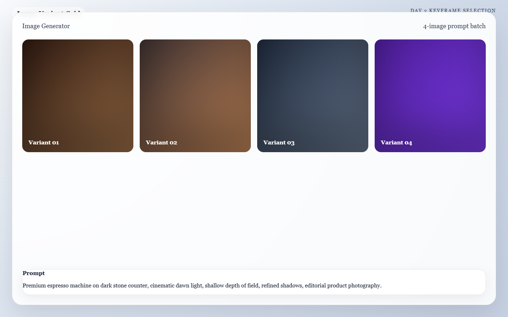
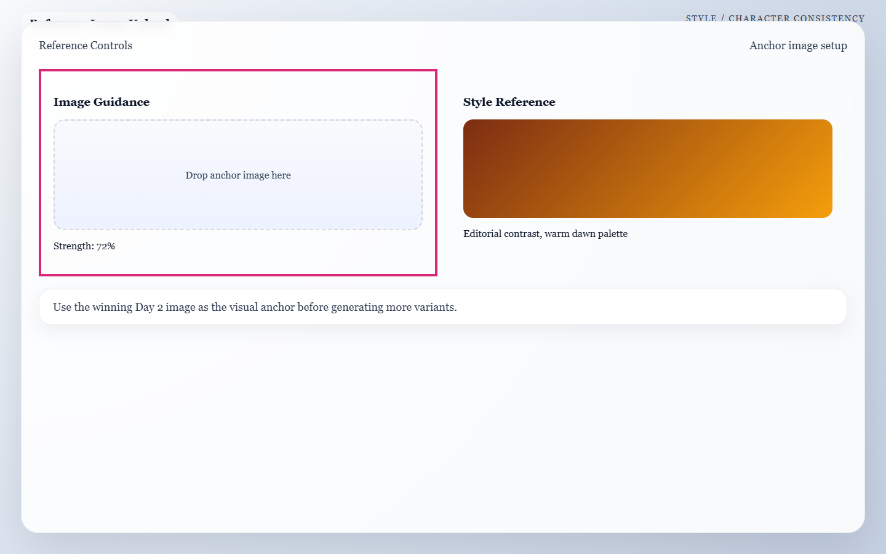

  <button type="button" class="language-switcher__button is-active" data-language-target="en" aria-pressed="true">English</button>
  <button type="button" class="language-switcher__button" data-language-target="ar" aria-pressed="false">العربية</button>

# Day 2: Mastering the Frame

Today is about consistency. You are not chasing random pretty images. You are building five frames that look like they belong to the same film, the same world, and the same idea.

!!! success "Today's Mission"
    Generate one strong, visually perfect keyframe for each of your 5 planned shots. By the end of today, you will have a complete "animatic" (a static storyboard) that looks like a high-end film, ready to be handed off to the motion engines tomorrow.

## What You Need Before You Start
* **Your Approved Blueprint:** The 5-shot storyboard you locked in yesterday.
* **Your Primary Image Generator:** (e.g., Leonardo.ai for practice, Midjourney for final production).
* **A Folder Structure:** Create a folder on your computer called `Project_Assets` with subfolders for `Shot_1`, `Shot_2`, etc.

---

## 🏃‍♂️ The Fast Track

If you are ready to generate, follow these steps to build your cinematic prompts and lock in your frames.

### Step 1 — Build your Master Visual Identity Block
If you improvise the prompt from scratch for every shot, the AI starts treating every frame like a new scene. That creates character drift and style collapse.

Before writing shot-specific prompts, write one reusable block of text that defines your exact subject and style.

* **Example Master Block:** *Sea turtle, textured shell, graceful underwater movement, cinematic realism, floating plastic debris, moody blue-green water, environmental documentary style, highly detailed natural light.*

### Step 2 — The Cinematic Prompt Formula
To get a cinematic frame, you must build your prompt using this exact structure. Copy this formula and combine it with your Master Block.

!!! tip "The Prompt Formula"
    `[Master Visual Identity Block]`, `[Shot-Specific Action]`, `[Environment Details]`, `[Camera Framing]`, `[Lighting Intent]`.

Let's look at how we take **Shot 1** from yesterday's sea turtle example and plug it into the formula:

> **The Final Prompt:** > *Sea turtle with textured shell, cinematic realism, extreme close-up of its eye and face moving through murky blue-green water, tiny plastic particles drifting in the current, soft underwater light rays, shallow depth of field, environmental documentary style, highly detailed, 8k.*

### Step 3 — Generate Multiple Variants
Paste your prompt into your AI image generator. Do not lock onto the first acceptable image. Generate 4 to 8 variations per shot. 

*Caption: A four-variant image batch that helps you compare composition, lighting, and detail before picking a winning frame.*

### Step 4 — Compare Shots Together, Not in Isolation
An image can be strong on its own and still fail the sequence. Put your 5 selected images side-by-side on your screen and ask:
* Do these feel like the same world?
* Does the subject remain recognizable?
* Is the visual escalation working from Shot 1 to Shot 5?

### Step 5 — Save Finals & Note Continuity Locks
Save your 5 winning images into your organized folders. Record the exact prompt you used for each. 

---

## 🧠 The Deep Dive

Expand these sections to master the advanced techniques of visual consistency and learn how to troubleshoot AI hallucinations.

??? info "Why static frames come before motion"
    If the starting keyframe is weak, motion engines will usually amplify that weakness. A strong still image gives you a "visual contract." It forces the AI video generator to respect your lighting, composition, and subject design, rather than inventing its own.

??? info "The Consistency Cheat Code: CREF and SREF"
    Different tools use different names, but the core mechanics are the same. If your tool supports reference images, use them to lock in your world.
    
    * **Character Reference (CREF):** Tells the AI to keep the subject's face, identity, or product design exactly the same as a provided image.
    * **Style Reference (SREF):** Tells the AI to match the lighting, color grading, and texture of a provided image, even if the scene changes completely.
    
    **Practical Workflow:** Generate one excellent anchor image first (usually your Hero Shot). Then, use that image as an SREF or CREF for the remaining 4 shots to force the AI to keep the lighting and subject identical.

    

    *Caption: A reference-image setup view that highlights where to lock consistency before generating more frames.*

??? warning "Troubleshooting: The character/product keeps changing"
    Shorten the variable part of your prompt and strengthen the fixed Master Block. If the AI still drifts, you *must* use a reference image (CREF) instead of relying on text alone. 

??? warning "Troubleshooting: Every image looks over-designed and plastic"
    Reduce style adjectives like "hyper-detailed, insane graphics, trending on artstation." Focus purely on the subject, camera framing, and light. Too much decorative prompting creates generic AI gloss instead of cinematic realism.

??? warning "Troubleshooting: I can't pick a final frame"
    Choose the image that best supports the *full sequence*, not the image that looks most flashy on its own. For example, if a shot is meant to reveal a small detail, choose the frame with the highest clarity over the one with the craziest lighting.

---

## ✅ Day 2 Checkpoint

Before moving on, confirm that your 5 selected frames:

- [ ] Match their assigned role from the Day 1 storyboard.
- [ ] Preserve the exact same subject identity and style world.
- [ ] Have a clear focal point.
- [ ] Avoid defects (like tangled fingers or warped metal) that motion would exaggerate tomorrow.

**Tomorrow:** Day 3 takes these perfect still frames and hands them over to the physics engines to breathe life into them with cinematic camera movement.

# اليوم الثاني: إتقان الإطار

هذا اليوم كله عن الاتساق. أنت لا تطارد صورًا جميلة بشكل عشوائي، بل تبني خمس لقطات ثابتة تبدو وكأنها تنتمي إلى الفيلم نفسه، والعالم نفسه، والفكرة نفسها.

!!! success "مهمة اليوم"
    أنشئ Keyframe قويًا ومتقنًا لكل واحدة من اللقطات الخمس التي خططت لها. بنهاية اليوم يجب أن تمتلك Animatic ثابتًا يشبه فيلمًا عالي الجودة وجاهزًا للانتقال إلى محركات الحركة غدًا.

## ما الذي تحتاجه قبل أن تبدأ
* **Blueprint المعتمد:** الـ Storyboard المكوّن من خمس لقطات الذي ثبّتَّه أمس.
* **مولد الصور الأساسي:** مثل Leonardo.ai للتدرب أو Midjourney للإنتاج النهائي.
* **بنية مجلدات:** أنشئ مجلدًا باسم `Project_Assets` وداخله مجلدات فرعية مثل `Shot_1` و`Shot_2` وهكذا.

---

## 🏃‍♂️ المسار السريع

إذا كنت جاهزًا للتوليد، فاتبع هذه الخطوات لبناء Prompts سينمائية وتثبيت الإطارات.

### الخطوة 1 — ابنِ Master Visual Identity Block
إذا ارتجلت Prompt جديدًا من الصفر لكل لقطة، سيعامل AI كل إطار على أنه مشهد جديد. وهكذا يبدأ Character Drift وينهار الاتساق البصري.

قبل كتابة Prompts الخاصة بكل لقطة، اكتب Block واحدًا يعبر عن الموضوع والأسلوب بدقة.

* **مثال على Master Block:** *Sea turtle, textured shell, graceful underwater movement, cinematic realism, floating plastic debris, moody blue-green water, environmental documentary style, highly detailed natural light.*

### الخطوة 2 — صيغة الـ Prompt السينمائي
لتحصل على إطار سينمائي، ابنِ Prompt بهذا الترتيب المحدد، ثم ادمجه مع Master Block.

!!! tip "صيغة الـ Prompt"
    `[Master Visual Identity Block]`, `[Shot-Specific Action]`, `[Environment Details]`, `[Camera Framing]`, `[Lighting Intent]`.

لنأخذ **Shot 1** من مثال السلحفاة البحرية ونطبقه على الصيغة:

> **The Final Prompt:** > *Sea turtle with textured shell, cinematic realism, extreme close-up of its eye and face moving through murky blue-green water, tiny plastic particles drifting in the current, soft underwater light rays, shallow depth of field, environmental documentary style, highly detailed, 8k.*

### الخطوة 3 — ولّد عدة Variants
ألصق Prompt في مولد الصور الخاص بك. لا تتعلق بأول نتيجة مقبولة. ولّد من 4 إلى 8 Variants لكل لقطة.

*Caption: دفعة من أربع نسخ تساعدك على مقارنة التكوين والإضاءة والتفاصيل قبل اختيار الإطار الفائز.*

### الخطوة 4 — قارن اللقطات معًا لا كل واحدة وحدها
قد تكون الصورة قوية بمفردها لكنها تفشل داخل التسلسل الكامل. ضع اللقطات الخمس جنبًا إلى جنب واسأل نفسك:
* هل تبدو من العالم نفسه؟
* هل بقي الموضوع قابلاً للتعرف بوضوح؟
* هل يعمل التصاعد البصري من Shot 1 إلى Shot 5؟

### الخطوة 5 — احفظ النسخ النهائية وسجل Continuity Locks
احفظ الصور الخمس الفائزة داخل المجلدات المرتبة. وسجل Prompt النهائي الذي استخدمته لكل لقطة.

---

## 🧠 التعمق

افتح الأقسام التالية لتتقن تقنيات الاتساق البصري وتتعلم كيف تتعامل مع هلوسات AI.

??? info "لماذا تأتي الصور الثابتة قبل الحركة"
    إذا كان Keyframe الأول ضعيفًا، فعادةً ستضاعف محركات الحركة هذا الضعف. الصورة الثابتة القوية تفرض "عقدًا بصريًا" يجبر مولد الفيديو على احترام الإضاءة والتكوين وتصميم الموضوع بدل أن يخترع عالمه الخاص.

??? info "الاختصار السحري للاتساق: CREF وSREF"
    أسماء الأدوات تختلف، لكن الفكرة الأساسية واحدة. إذا كانت أداتك تدعم الصور المرجعية، فاستخدمها لتثبيت العالم البصري.
    
    * **Character Reference (CREF):** يطلب من AI الحفاظ على وجه الموضوع أو هويته أو تصميمه كما هو تمامًا.
    * **Style Reference (SREF):** يطلب من AI مطابقة الإضاءة وColor Grading والملمس حتى لو تغيّر المشهد.
    
    **Workflow عملي:** ولّد أولاً صورة مرجعية ممتازة، وغالبًا تكون Hero Shot. بعد ذلك استخدمها كـ SREF أو CREF للقطات الأربع الأخرى كي يبقى الضوء والموضوع متسقين.

    

    *Caption: واجهة إعداد المرجع البصري التي توضّح مكان تثبيت الاتساق قبل توليد بقية الإطارات.*

??? warning "حل مشكلة: الشخصية أو المنتج يتغيران باستمرار"
    قلّل الجزء المتغير من Prompt وقوِّ Master Block الثابت. وإذا استمر الانجراف، فعليك استخدام صورة مرجعية CREF بدل الاعتماد على النص وحده.

??? warning "حل مشكلة: كل الصور تبدو بلاستيكية ومصطنعة"
    خفف كلمات الزينة مثل hyper-detailed وinsane graphics وtrending on artstation. ركّز على الموضوع والكادر والإضاءة. المبالغة في الزخرفة تنتج لمعانًا اصطناعيًا بدل الواقعية السينمائية.

??? warning "حل مشكلة: لا أستطيع اختيار الإطار النهائي"
    اختر الصورة التي تخدم التسلسل كاملًا، لا الصورة الأكثر بهرجة وحدها. إذا كانت اللقطة مخصصة لإظهار تفصيل صغير، فالأولوية للوضوح لا للإضاءة المجنونة.

---

## ✅ نقطة التحقق لليوم الثاني

قبل أن تنتقل إلى الخطوة التالية، تأكد أن الإطارات الخمسة المختارة:

- [ ] تطابق دورها المحدد في Storyboard اليوم الأول.
- [ ] تحافظ على هوية الموضوع والعالم البصري نفسيهما.
- [ ] تمتلك نقطة تركيز واضحة.
- [ ] لا تحتوي على عيوب ستجعل الحركة غدًا أسوأ.

**غدًا:** يأخذ Day 3 هذه الصور الثابتة القوية ويعطيها لمحركات الحركة لتبدأ في إحيائها بحركة كاميرا سينمائية.

