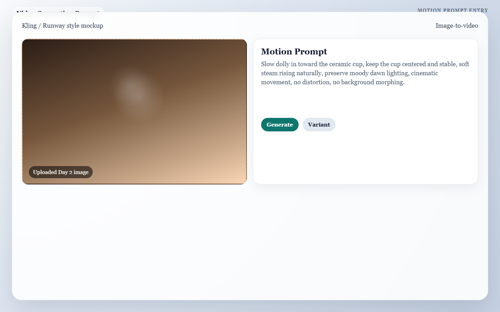

  <button type="button" class="language-switcher__button is-active" data-language-target="en" aria-pressed="true">English</button>
  <button type="button" class="language-switcher__button" data-language-target="ar" aria-pressed="false">العربية</button>

# Day 3: Breathing Life

Now you turn still images into moving shots without letting the AI wreck the quality you worked for yesterday. The goal is controlled motion, not flashy chaos.

!!! success "Today's Mission"
    Create short, believable video clips from your Day 2 keyframes using deliberate motion instructions instead of random animation. By the end of today, you will have a rough, moving sequence of your entire video.

## What You Need Before You Start
* **Your Approved Keyframes:** The 5 perfect static images you generated on Day 2.
* **Your Primary Video Generator:** (e.g., Kling AI or Minimax for free daily credits, Runway Gen-3 or Luma for pro rendering).
* **Storage Space:** A folder to save multiple `.mp4` clip attempts for each shot.

---

## 🏃‍♂️ The Fast Track

If you are ready to animate, follow these steps to turn your static images into high-quality video clips.

### Step 1 — Define the Motion Role
Before uploading an image, decide what the motion is supposed to achieve. Do not just make it move for the sake of moving. Pick one role for each shot:
* **Reveal:** Introduces the subject (e.g., pan left).
* **Emphasis:** Draws attention to a detail (e.g., slow push-in).
* **Hold:** Keeps the camera locked while preserving atmosphere (e.g., steam rising).

### Step 2 — Separate Camera vs. Subject Motion
Treat these as two completely different systems in your prompt. 
* **Camera Motion:** Pan, tilt, dolly, push-in, orbit.
* **Subject Motion:** Hand movement, steam rising, liquid pouring, fabric shifting.

!!! tip "The Golden Rule of AI Motion"
    Start with **one dominant camera move** and **minimal subject motion**. If you ask for too much at once, the AI will hallucinate and distort your image.

### Step 3 — The Motion Prompt Template
When uploading your Day 2 image into your video generator, use this structure to tell the AI exactly how to animate it:

> **The Motion Prompt Formula:** > `[Primary Camera Motion]`, `[Secondary Subject Motion]`, keep `[Subject]` stable, preserve `[Identity Details]`, natural cinematic movement, no distortion, no warping.

**Example for our Shot 4 (The Sea Turtle):** > *Slow tracking move following the sea turtle as it pushes toward clearer water, keep the shell shape stable, plastic debris drifting gently in the background, preserve moody underwater lighting, cinematic movement, no distortion, no body warping.*

*Caption: A Day 3 motion setup where the still image is uploaded first and the camera-movement prompt is entered before rendering short clip variants.*

### Step 4 — Generate & Keep Clips Short
Generate the clip. If your tool allows you to set the duration, choose **5 seconds** (or the shortest option). Shorter clips are much easier for the AI to keep stable. 

### Step 5 — Approve Only Edit-Ready Clips
Generate 3 to 4 variations of motion for the same shot. Keep only the clips that:
* Preserve the visual quality of your Day 2 frame.
* Support the storyboard action.
* Do not have melting faces or warped backgrounds.

---

## 🧠 The Deep Dive

Expand these sections to understand the physics of AI video generation and how to save a clip that keeps breaking.

??? info "Think in Physics, not just Aesthetics"
    The best motion prompts respect what should logically move in the real world. 
    * Steam can drift and curl.
    * A camera can push in slowly.
    * A sea turtle should glide with weight and intention, not jerk around like a toy.
    If your text prompt violates the material logic of the scene, the AI will try to bend reality to accommodate you, and the output will look fake.

??? info "The Camera Movement Library"
    Use these specific terms in your prompts to control the "virtual camera":
    * **Push-in / Dolly-in:** Adds focus and importance to a subject.
    * **Pull-back:** Creates context or a feeling of calm.
    * **Pan:** Reveals width or guides the eye left/right.
    * **Locked shot with secondary motion:** The safest option when the frame is already beautiful. (e.g., "Static camera, dust motes floating").
    * *Warning:* Avoid "Orbit" moves unless absolutely necessary. They look impressive but frequently cause the subject's geometry to drift.

??? warning "Troubleshooting: The product changes shape or melts"
    Reduce the amount of subject motion in your prompt and use a simpler, slower camera move. If the product still melts, you may need to pick a cleaner Day 2 frame that has simpler lighting reflections.

??? warning "Troubleshooting: The clip starts great but breaks at the end"
    This is the most common AI video artifact. The AI "forgets" the physics by second 4 or 5. Save the clip anyway! We will trim off the broken ending during Day 6 (Editing). As long as you have 2 solid seconds of usable footage, the clip is a success.

??? warning "Troubleshooting: Every shot feels too static or boring"
    Add one small element of secondary motion instead of forcing a massive camera move. Prompting for "soft steam," "light flicker," "dust motes," or "leaves blowing" adds incredible life to a locked camera shot.

---

## ✅ Day 3 Checkpoint

Before moving on, confirm that your generated clips:

- [ ] Preserve the identity of the subject from your Day 2 images.
- [ ] Fit their storyboard role without moving too chaotically.
- [ ] Have at least 2 to 3 seconds of usable, un-warped footage.

**Tomorrow:** Day 4 is all about the spoken word—adding voiceovers and dialogue (only if your project actually needs it).

# اليوم الثالث: بث الحياة

الآن ستأخذ الصور الثابتة وتحولها إلى لقطات متحركة من دون أن تسمح للذكاء الاصطناعي بتخريب الجودة التي عملت عليها أمس. الهدف هو حركة مضبوطة، لا فوضى بصرية لامعة.

!!! success "مهمة اليوم"
    أنشئ لقطات فيديو قصيرة ومقنعة انطلاقًا من Keyframes اليوم الثاني، باستخدام تعليمات حركة مقصودة بدل التحريك العشوائي. بنهاية اليوم يجب أن تمتلك تسلسلاً متحركًا أوليًا للفيديو بالكامل.

## ما الذي تحتاجه قبل أن تبدأ
* **Keyframes المعتمدة:** الصور الخمس الثابتة التي أنشأتها في Day 2.
* **مولد الفيديو الأساسي:** مثل Kling AI أو Minimax للتجربة المجانية، أو Runway Gen-3 أو Luma للإنتاج الاحترافي.
* **مساحة تخزين:** مجلد لحفظ محاولات `.mp4` المتعددة لكل لقطة.

---

## 🏃‍♂️ المسار السريع

إذا كنت جاهزًا للتحريك، فاتبع هذه الخطوات لتحويل الصور الثابتة إلى لقطات فيديو جيدة.

### الخطوة 1 — حدّد دور الحركة
قبل رفع الصورة، قرر ما الذي يجب أن تحققه الحركة. لا تجعلها تتحرك فقط لمجرد الحركة. اختر دورًا واحدًا لكل لقطة:
* **Reveal:** تقديم الموضوع.
* **Emphasis:** توجيه الانتباه إلى تفصيل محدد.
* **Hold:** إبقاء الكاميرا ثابتة مع الحفاظ على الجو العام.

### الخطوة 2 — افصل بين حركة الكاميرا وحركة الموضوع
تعامل معهما كنظامين مختلفين تمامًا داخل Prompt.
* **Camera Motion:** مثل pan وtilt وdolly وpush-in وorbit.
* **Subject Motion:** مثل حركة اليد أو تصاعد البخار أو سكب السائل أو تحرك القماش.

!!! tip "القاعدة الذهبية لحركة AI"
    ابدأ **بحركة كاميرا واحدة أساسية** مع **أقل قدر ممكن من حركة الموضوع**. إذا طلبت الكثير دفعة واحدة، سيبدأ AI بالهلوسة وتشويه الصورة.

### الخطوة 3 — قالب Motion Prompt
عند رفع صورة Day 2 في مولد الفيديو، استخدم هذا البناء لتشرح لـ AI كيف يجب أن يحركها:

> **The Motion Prompt Formula:** > `[Primary Camera Motion]`, `[Secondary Subject Motion]`, keep `[Subject]` stable, preserve `[Identity Details]`, natural cinematic movement, no distortion, no warping.

**مثال على Shot 4 (السلحفاة البحرية):** > *Slow tracking move following the sea turtle as it pushes toward clearer water, keep the shell shape stable, plastic debris drifting gently in the background, preserve moody underwater lighting, cinematic movement, no distortion, no body warping.*

*Caption: إعداد حركة لليوم الثالث حيث تُرفع الصورة أولًا ثم يُكتب Prompt الحركة قبل توليد عدة نسخ قصيرة.*

### الخطوة 4 — ولّد وحافظ على قصر اللقطات
ولّد الفيديو. وإذا كانت الأداة تسمح بتحديد المدة، فاختر **5 ثوانٍ** أو أقل مدة ممكنة. اللقطات الأقصر أسهل بكثير على AI في الحفاظ على استقرارها.

### الخطوة 5 — احتفظ فقط باللقطات الجاهزة للمونتاج
ولّد 3 إلى 4 Variants للحركة نفسها. واحتفظ فقط بالنسخ التي:
* تحافظ على جودة صورة Day 2.
* تخدم فعل Storyboard.
* لا تحتوي على تشوهات واضحة في الوجوه أو الخلفيات.

---

## 🧠 التعمق

افتح الأقسام التالية لتفهم فيزياء توليد الفيديو بالذكاء الاصطناعي وكيف تنقذ لقطة بدأت تنهار.

??? info "فكّر بالفيزياء لا بالشكل فقط"
    أفضل Prompts للحركة تحترم ما يمكن أن يتحرك منطقيًا في العالم الحقيقي.
    * البخار يمكن أن يتصاعد ويلتف.
    * الكاميرا يمكن أن تتقدم ببطء.
    * السلحفاة البحرية يجب أن تنساب بوزن وإحساس طبيعي، لا أن تقفز مثل لعبة.
    إذا خالف Prompt المنطق المادي للمشهد، سيحاول AI ثني الواقع لإرضاء الطلب، وستبدو النتيجة مزيفة.

??? info "مكتبة حركات الكاميرا"
    استخدم هذه المصطلحات للتحكم في "الكاميرا الافتراضية":
    * **Push-in / Dolly-in:** يزيد التركيز والأهمية.
    * **Pull-back:** يضيف سياقًا أو هدوءًا.
    * **Pan:** يكشف العرض ويوجه العين يمينًا ويسارًا.
    * **Locked shot with secondary motion:** الخيار الأكثر أمانًا عندما يكون الإطار جميلًا أصلًا.
    * *تحذير:* تجنب حركة **Orbit** إلا عند الضرورة، لأنها غالبًا تفسد هندسة الموضوع.

??? warning "حل مشكلة: المنتج يتشوه أو يذوب"
    قلّل حركة الموضوع داخل Prompt واستخدم حركة كاميرا أبسط وأبطأ. وإذا استمرت المشكلة، فقد تحتاج إلى اختيار إطار أنظف من Day 2 بإضاءة أبسط وانعكاسات أقل تعقيدًا.

??? warning "حل مشكلة: اللقطة تبدأ جيدة ثم تنهار في النهاية"
    هذا من أكثر عيوب فيديو AI شيوعًا. الذكاء الاصطناعي "ينسى" الفيزياء بعد الثانية الرابعة أو الخامسة. احفظ اللقطة رغم ذلك، لأننا سنقص النهاية المكسورة في Day 6. إذا امتلكت ثانيتين أو ثلاث ثوانٍ جيدات، فاللقطة ناجحة.

??? warning "حل مشكلة: كل اللقطات ساكنة ومملة"
    أضف عنصرًا صغيرًا من الحركة الثانوية بدل فرض حركة كاميرا ضخمة. كلمات مثل soft steam أو light flicker أو dust motes أو leaves blowing تمنح الحياة للقطات الثابتة.

---

## ✅ نقطة التحقق لليوم الثالث

قبل أن تنتقل، تأكد أن اللقطات المتحركة التي أنشأتها:

- [ ] تحافظ على هوية الموضوع من صور Day 2.
- [ ] تخدم دورها في Storyboard من دون فوضى زائدة.
- [ ] تحتوي على ثانيتين إلى ثلاث ثوانٍ صالحات للاستخدام من دون تشوه مزعج.

**غدًا:** يتمحور Day 4 حول الكلمة المنطوقة، أي إضافة Voiceover وDialogue فقط إذا كان المشروع يحتاج ذلك فعلًا.

