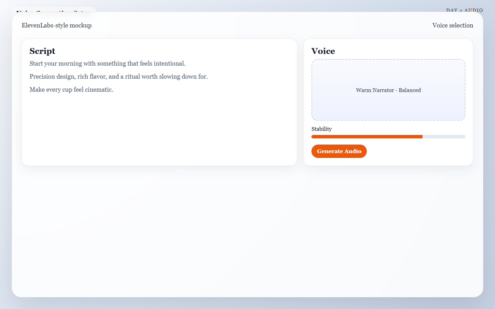

  <button type="button" class="language-switcher__button is-active" data-language-target="en" aria-pressed="true">English</button>
  <button type="button" class="language-switcher__button" data-language-target="ar" aria-pressed="false">العربية</button>

# Day 4: The Spoken Word

Voice can lift the piece or make it worse. Today is about using speech only when it adds clarity, persuasion, or emotion, and skipping it when the visuals already do the job.

!!! success "Today's Mission"
    Generate a clean voice track and sync it to your visuals *only* if dialogue or narration improves the piece. By the end of today, you will have a short, approved script and a final voiceover file ready for editing.

## What You Need Before You Start
* **Your Approved Clips:** The video clips you generated on Day 3.
* **A Decision:** Are you using Voiceover (off-screen speaking), Dialogue (on-screen lip sync), or no voice at all?
* **Your Primary Audio Generator:** (e.g., ElevenLabs for voice generation).

---

## 🏃‍♂️ The Fast Track

If you are ready to give your video a voice, follow these steps to write and generate your audio track.

### Step 1 — The "Speech Test"
Before you write a single word, ask yourself: *Would this video become clearer, more persuasive, or more emotional with a voice track?* If the answer is no, skip speech and move straight to Day 5 with confidence! Silence (with good music) is often more premium than unnecessary talking.

### Step 2 — The 3-Line Script Formula
If one sentence can do the job, do not write three. Write your script one line at a time, aiming for clarity over cleverness.

!!! tip "The Script Template"
    * **Line 1 (The Hook):** An emotional setup or question.
    * **Line 2 (The Core Message):** The benefit, transformation, or key information.
    * **Line 3 (The Closing):** A call to action or final lingering thought.

**Example Script (The Ocean Conservation Short):** > *Beneath the surface, survival is getting harder every day.* (Hook)
> *Plastic drifts where marine life should be free to move.* (Core Message)
> *Protect the ocean before silence becomes the only thing left.* (Closing)

### Step 3 — Generate & Select
Take your script to your voice generator (like ElevenLabs). Test variations in pace, warmth, and authority. Generate several readings. Choose the take that sounds the most natural and leaves enough pauses for music to breathe later.

*Caption: A voice-generation setup for Day 4 with the approved three-line script loaded and a warm narrator voice selected for testing.*

### Step 4 — The Lip Sync Rule
If your character is speaking directly to the camera, you will need a lip-sync tool (like Kling AI, HeyGen, or SyncLabs). 

**Only use lip sync if:**
1. The mouth is clearly visible in your Day 3 video clip.
2. The shot is incredibly stable.
3. The speech materially improves the scene.

---

## 🧠 The Deep Dive

Expand these sections to understand the nuances of audio pacing and how to fix robotic voice generations.

??? info "Voiceover vs. On-Screen Dialogue"
    * **Voiceover (Narration):** Extremely safe and easy to control. You generate an audio file and lay it over your visuals. It usually feels highly cinematic and professional.
    * **On-Screen Dialogue (Lip Sync):** High risk. The AI lip sync and facial fidelity must hold up perfectly. If the lip sync is off by even a fraction of a second, the viewer will instantly feel the "uncanny valley" effect, ruining the illusion of your video. If you are unsure, choose voiceover.

??? info "Where to place speech in the timeline"
    Do not force words over every single scene. The strongest placement for voiceover is often:
    * Right after the opening visual hook.
    * During the clearest explanatory shot.
    * Right before the final payoff or call to action.
    Give your audience time to actually *look* at your beautiful visuals without someone talking in their ear the whole time.

??? warning "Troubleshooting: The voice sounds artificial or robotic"
    Try a simpler script, slower pacing, or a more neutral-sounding voice model. Overwritten, overly dramatic copy often sounds much more robotic than plain, conversational language. You can also try adding punctuation (like ellipses `...` or em dashes `—`) to force the AI to take natural breaths.

??? warning "Troubleshooting: The lip sync looks distracting"
    Ditch it and use voiceover instead. Do not keep visible lip sync in your video just because it was technically possible to make. If it looks weird, the audience will click away.

??? warning "Troubleshooting: The script feels too long"
    Cut every sentence that simply repeats what the visuals are already showing. If the screen already shows a turtle trapped in polluted water, the voiceover should add meaning, not just narrate the obvious.

---

## ✅ Day 4 Checkpoint

Before moving on, confirm that your spoken layer:

- [ ] Adds value rather than clutter.
- [ ] Matches the emotional tone of your visuals.
- [ ] Is short enough to remain memorable.
- [ ] Avoids bad lip-sync shots that weaken the project's realism.

**Tomorrow:** Day 5 is where the magic really happens. We will add music and sound effects (Foley) to create atmosphere, scale, and momentum.

# اليوم الرابع: الكلمة المنطوقة

الصوت يمكن أن يرفع العمل أو يضعفه. هذا اليوم كله عن استخدام الكلام فقط عندما يضيف وضوحًا أو إقناعًا أو أثرًا عاطفيًا، وتجاهله عندما تكون الصورة وحدها كافية.

!!! success "مهمة اليوم"
    أنشئ Voice Track نظيفًا وازمنه مع الصورة **فقط** إذا كان Dialogue أو Narration سيحسن القطعة. بنهاية اليوم يجب أن تمتلك Script قصيرًا معتمدًا وملف Voiceover نهائيًا جاهزًا للمونتاج.

## ما الذي تحتاجه قبل أن تبدأ
* **اللقطات المعتمدة:** الفيديوهات التي أنشأتها في Day 3.
* **قرار واضح:** هل ستستخدم Voiceover خارج الكادر، أم Dialogue مع Lip Sync، أم لا صوت إطلاقًا؟
* **مولد الصوت الأساسي:** مثل ElevenLabs.

---

## 🏃‍♂️ المسار السريع

إذا كنت جاهزًا لإعطاء الفيديو صوتًا، فاتبع هذه الخطوات لكتابة المسار الصوتي وتوليده.

### الخطوة 1 — اختبار الكلام
قبل أن تكتب كلمة واحدة، اسأل نفسك: *هل سيصبح هذا الفيديو أوضح أو أكثر إقناعًا أو أكثر عاطفة إذا أضفت Voice Track؟* إذا كانت الإجابة لا، فتجاوز الصوت وانتقل مباشرة إلى Day 5 بثقة. الصمت المدعوم بموسيقى جيدة يبدو أحيانًا أكثر فخامة من الكلام غير الضروري.

### الخطوة 2 — صيغة Script من ثلاث جمل
إذا كانت جملة واحدة تكفي، فلا تكتب ثلاثًا. اكتب Script سطرًا سطرًا، وامنح الوضوح أولوية على الاستعراض.

!!! tip "قالب الـ Script"
    * **السطر 1 (The Hook):** سؤال أو تمهيد عاطفي.
    * **السطر 2 (The Core Message):** الفائدة أو التحول أو الفكرة الأساسية.
    * **السطر 3 (The Closing):** Call to Action أو عبارة ختامية تبقى في الذهن.

**مثال Script (فيديو حماية المحيط):** > *Beneath the surface, survival is getting harder every day.* (Hook)
> *Plastic drifts where marine life should be free to move.* (Core Message)
> *Protect the ocean before silence becomes the only thing left.* (Closing)

### الخطوة 3 — ولّد واختر
خذ Script إلى مولد الصوت مثل ElevenLabs. جرّب أكثر من قراءة بسرعات وطبقات دفء وثقة مختلفة. اختر النسخة الأكثر طبيعية والتي تترك مساحات تتنفس فيها الموسيقى لاحقًا.

*Caption: إعداد توليد صوت لليوم الرابع مع Script معتمد وصوت راوٍ دافئ قيد التجربة.*

### الخطوة 4 — قاعدة Lip Sync
إذا كان Character يتحدث مباشرة إلى الكاميرا، فستحتاج إلى أداة Lip Sync مثل Kling AI أو HeyGen أو SyncLabs.

**استخدم Lip Sync فقط إذا:**
1. كان الفم ظاهرًا بوضوح في لقطة Day 3.
2. كانت اللقطة ثابتة جدًا.
3. كان الكلام يضيف قيمة حقيقية للمشهد.

---

## 🧠 التعمق

افتح الأقسام التالية لفهم إيقاع الصوت وكيف تعالج الأصوات الروبوتية.

??? info "Voiceover أم On-Screen Dialogue؟"
    * **Voiceover (Narration):** الخيار الأسهل والأكثر أمانًا. تولد ملفًا صوتيًا وتضعه فوق الصورة، وغالبًا يبدو سينمائيًا واحترافيًا.
    * **On-Screen Dialogue (Lip Sync):** خيار عالي المخاطرة. يجب أن يصمد التطابق بين الفم والصوت وتفاصيل الوجه بدقة. وإذا انزاح التزامن قليلًا فقط، سيشعر المشاهد مباشرة بالغرابة ويفقد الإيهام. إذا كنت مترددًا، اختر Voiceover.

??? info "أين تضع الكلام داخل الـ Timeline"
    لا تضع الكلمات فوق كل مشهد. أقوى أماكن Voiceover غالبًا تكون:
    * بعد الـ Visual Hook الافتتاحي مباشرة.
    * أثناء أوضح لقطة تفسيرية.
    * قبل الـ Payoff النهائي أو Call to Action.
    أعطِ الجمهور وقتًا لينظر إلى الصورة الجميلة بدل أن يتلقى كلامًا مستمرًا دون توقف.

??? warning "حل مشكلة: الصوت يبدو صناعيًا أو روبوتيًا"
    جرّب Script أبسط، أو سرعة أبطأ، أو Voice Model أكثر حيادًا. النص المبالغ فيه يبدو أكثر اصطناعية من اللغة البسيطة. ويمكنك أيضًا إضافة علامات ترقيم مثل `...` أو `—` لفرض تنفسات طبيعية.

??? warning "حل مشكلة: Lip Sync مشتت"
    تخلَّ عنه واستخدم Voiceover. لا تُبقِ Lip Sync ظاهرًا لمجرد أنك استطعت توليده تقنيًا. إذا بدا غريبًا، فالمشاهد سيشعر بذلك فورًا.

??? warning "حل مشكلة: الـ Script طويل"
    احذف كل جملة تعيد فقط ما تظهره الصورة. إذا كانت الشاشة تعرض سلحفاة عالقة في ماء ملوث، فالمطلوب من Voiceover أن يضيف معنى، لا أن يصف ما هو واضح أصلًا.

---

## ✅ نقطة التحقق لليوم الرابع

قبل أن تنتقل، تأكد أن الطبقة الصوتية لديك:

- [ ] تضيف قيمة بدل الفوضى.
- [ ] تناسب النبرة العاطفية للصورة.
- [ ] قصيرة بما يكفي لتبقى في الذاكرة.
- [ ] لا تعتمد على لقطات Lip Sync ضعيفة تضعف واقعية المشروع.

**غدًا:** في Day 5 يبدأ السحر الحقيقي. سنضيف الموسيقى والمؤثرات الصوتية (Foley) لصناعة الجو والحجم والزخم.

