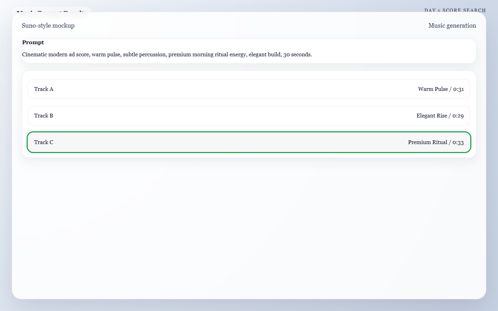

??? abstract "Meta: Page Purpose & Maintenance (For Agents & Instructors)"
    **Purpose:** This page teaches Day 5 of the AI Director Course: music, ambience, and sound effects. It exists to help learners build the emotional layer that makes AI-generated visuals feel more cinematic and believable. AI agents should treat this page as a craft-focused lesson centered on pacing, mood, and realism.
    
    **Maintenance Instructions:** Update this page when music-generation workflows, Foley recommendations, or sound-design checklists improve. Keep the advice connected to the edit structure learners will use on Day 6.

# Day 5: The Atmosphere

!!! success "Today's Mission"
    Choose (or generate) a music track and gather enough sound effects to make your sequence feel grounded in reality. By the end of today, you will have a cleanly organized audio folder ready to be dropped into your editing timeline tomorrow.

## What You Need Before You Start
* **Your Approved Clips:** The video clips you generated on Day 3.
* **Your Voice Track:** Any voiceover or dialogue you generated on Day 4 (if applicable).
* **Your Audio Tools:** (e.g., Suno or Udio for music generation, Freesound.org for sound effects).
* **A Folder:** Create an `Audio_Assets` folder on your computer to keep your downloads organized.

---

## 🏃‍♂️ The Fast Track

If you are ready to score your film, follow these 4 steps to build your audio bed.

### Step 1 — Decide the Emotional Lane
Before generating music, pick one dominant mood that matches the visual identity you already built:
* Calm Luxury
* Kinetic Energy
* Cinematic Tension
* Playful Curiosity
* Reflective Atmosphere

### Step 2 — Generate the Music Bed
Head to your AI music generator (like Suno). Use your chosen emotional lane, the pacing of your video, and the genre to prompt the AI. 

**Example Music Prompt:** > *Cinematic ambient track, calm luxury, slow building strings, moody electronic pulse, no vocals, 80 BPM.*

*Caption: A Day 5 music pass where one prompt generates multiple score options so you can pick the track that best supports the edit.*

### Step 3 — The Foley Spotting Sheet
"Foley" refers to the everyday sound effects added to films (like footsteps or pouring liquid). Watch your video clips and write down a quick list of exactly where sound will matter most.

!!! tip "Foley Spotting Example"
    * **Shot 1 (Machine turning on):** Needs a crisp mechanical *click*.
    * **Shot 3 (Espresso pouring):** Needs a rich, warm *liquid pouring* sound.
    * **Shot 4 (Camera pushing in):** Needs a subtle, low-frequency *whoosh* to match the camera movement.
    * **Overall Ambience:** Needs a low *room tone* or *distant morning birds*.

### Step 4 — Hunt for Sound Effects
Head to a free library like Freesound.org or Pixabay. Search for the specific sounds on your spotting sheet. **Do not use AI to generate these.** Real, recorded sound effects are currently vastly superior to AI-generated sound effects for grounding a scene in reality. 

### Step 5 — Organize Everything
Rename your downloaded files so they are easy to find tomorrow. (e.g., `music-calm-luxury.mp3`, `sfx-heavy-click.wav`, `sfx-liquid-pour.wav`). Put them all in your `Audio_Assets` folder.

---

## 🧠 The Deep Dive

Expand these sections to understand why less is more when it comes to audio, and how to avoid making your video sound cheap.

??? info "Why audio matters so much"
    Weak visuals can sometimes be rescued by strong sound. Strong visuals *always* feel flat without it. Audio is 50% of the cinematic illusion. It creates scale, speed, intention, and emotional cohesion. If a heavy metal machine moves on screen but makes no sound, the viewer's brain instantly registers the video as "fake."

??? info "Why less audio often sounds more premium"
    Too many layers make AI work feel cheap or generic. Selective sound design gives each effect more meaning. Start with this priority order:
    1. Music bed
    2. Key Foley or impact sounds
    3. Ambient texture (room tone)
    4. Optional risers or whooshes
    If the piece still feels empty, add more. If it feels overwhelming, mute the least important layer.

??? info "Silence is a Tool"
    Not every shot needs a sound effect. Short, sudden drops in sound (like the music cutting out for one second right before the final payoff shot) can instantly increase the viewer's focus and make the ending feel massive.

??? warning "Troubleshooting: The video sounds overcrowded"
    Mute half the layers and see if the piece improves. Often, it does. You do not need a loud *whoosh* on every single cut. 

??? warning "Troubleshooting: The visuals feel expensive, but the sound feels cheap"
    Replace novelty, cartoonish effects with cleaner, subtler choices. Priority is realism and mood, not quantity. A real recording of a coffee cup hitting a saucer will always sound more premium than a synthesized "impact" sound.

??? warning "Troubleshooting: My voiceover disappears under the music"
    When you edit tomorrow, you will lower the music volume under the spoken lines (called "ducking"). For today, just ensure your music track isn't too aggressively loud or busy in the frequency ranges where the human voice sits.

---

## ✅ Day 5 Checkpoint

Before moving on, confirm that your audio plan:

- [ ] Supports the intended pace and emotion of the sequence.
- [ ] Emphasizes only the most important visual moments.
- [ ] Is cleanly organized into a folder for fast editing tomorrow.

**Tomorrow:** Day 6 is where the puzzle pieces finally lock together. We will drop all your visuals and audio into an editor and build the final timeline.