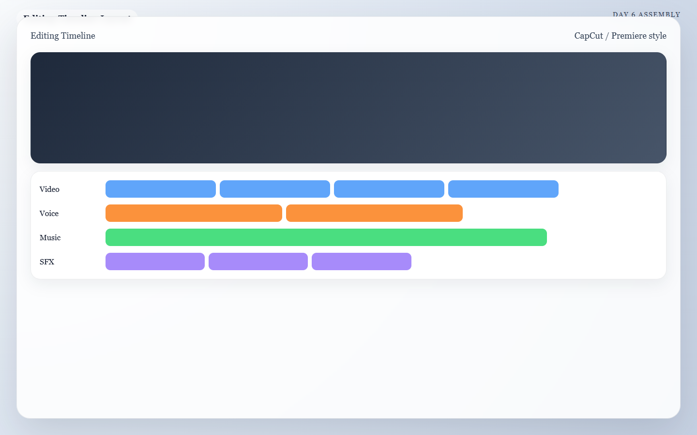

  <button type="button" class="language-switcher__button is-active" data-language-target="en" aria-pressed="true">English</button>
  <button type="button" class="language-switcher__button" data-language-target="ar" aria-pressed="false">العربية</button>

# Day 6: The Assembly Line

Today you stop thinking about separate assets and start thinking about the viewer's experience. The edit is where clips, sound, pacing, and emotion finally become one piece.

!!! success "Today's Mission"
    Assemble your final timeline, tighten the pacing, and apply a cohesive visual look. By the end of today, you will have a complete, near-final rough cut that already feels publishable.

## What You Need Before You Start
* **Your Final Visual Clips:** The `.mp4` files generated on Day 3.
* **Your Audio Folder:** The organized music, voice, and Foley assets from Days 4 and 5.
* **Your Blueprint:** Your Day 1 storyboard to remind you of the sequence order.
* **Your Video Editor:** An editing tool you can move quickly in (like the free CapCut Desktop app).

---

## 🏃‍♂️ The Fast Track

If you are ready to cut, open your editing software and follow this specific order of operations.

### Step 1 — Build the Skeleton 
Import *only* your approved assets. Do not clutter your project with every failed AI generation attempt. Drop your files onto the timeline in this exact order:
1. Video clips (in chronological 1-to-5 order)
2. Voiceover (if used)
3. Music bed
4. Essential Foley and transitions

### Step 2 — Trim Aggressively
Most AI clips are longer than they need to be, and they usually break at the end. Use your blade tool to trim the fat. 
* **Cut out:** Unstable openings, broken endings, repetitive middles, and any frames that expose a generation flaw.
* If a shot is beautiful but slows the piece down, shorten it. If it *still* slows the piece down, delete it.

### Step 3 — Sync the Rhythm
Shift your clips left or right so the cuts happen at intentional moments. You don't have to cut exactly on every single drum beat, but the overall sequence should feel tied to the audio.
* Sync cuts to the spoken cadence of the voiceover.
* Sync impact visuals (like a cup slamming down) to a heavy beat in the music.

*Caption: A clean assembly timeline with the video edit on top, narration in the middle, and music plus sound effects balanced underneath.*

### Step 4 — The Audio Balance Pass
Make sure the viewer can actually hear the story. 
* Lower the music volume (ducking) whenever the voiceover is speaking.
* Ensure your Foley sounds (like clicks or whooshes) are subtle, not deafening.
* Let one or two moments breathe in total silence before a big visual impact.

### Step 5 — The Finishing Polish
Apply one simple, global visual treatment to unify the sequence so it looks like it was all shot on the same camera.
* Apply a basic LUT (color filter) across all clips.
* Adjust contrast and exposure so Shot 1 matches the brightness of Shot 5.
* Add minimal text or titles only if they clarify the message.

---

## 🧠 The Deep Dive

Expand these sections to understand the psychology of the edit and how to fix a clunky timeline.

??? info "Edit Priorities: Clarity, Pacing, Style"
    When you are stuck on a cut, fall back on the priority list. 
    1. **Clarity first:** Does the viewer know what they are looking at?
    2. **Pacing second:** Does the energy build toward the end?
    3. **Style third:** Does it look cool?
    Never sacrifice clarity just to show off a stylish, but confusing, AI clip.

??? info "How to use Text Overlays wisely"
    If you use text on screen:
    * Keep it short (3-4 words max).
    * Place it in negative space where the frame is readable.
    * Do not let the text fight the main visual subject.
    * Use text to clarify the emotional benefit, not to explain exactly what is already on screen.

??? warning "Troubleshooting: The sequence feels slow and boring"
    Remove the weakest shot entirely, then tighten the duration of the remaining clips. A tight 15-second video is infinitely better than a dragging 30-second video.

??? warning "Troubleshooting: The edit feels flashy but confusing"
    You lost the plot. Return to your Day 1 storyboard. Strip away the heavy color grades, the crazy transitions, and the loud sound effects, and restore the simplest visual logic. 

??? warning "Troubleshooting: The video clips don't match visually"
    This happens if you didn't use Style References (SREF) on Day 2. To fix it in the edit, apply a strong, unified color grade (like a heavy cinematic teal-and-orange LUT or a stark black-and-white filter) to mask the differences. If one shot still wildly stands out, drop it.

---

## ✅ Day 6 Checkpoint

Before closing your editing software today, confirm that your rough cut:

- [ ] Reads clearly without explanation.
- [ ] Hides or removes the worst AI generation artifacts.
- [ ] Keeps music and voice in balance.
- [ ] Builds toward a strong final payoff shot.

**Tomorrow:** Day 7 is the finish line. We will review the piece, upscale it to 4K resolution, and export the final file.

# اليوم السادس: خط التجميع

اليوم تتوقف عن التفكير في الأصول كعناصر منفصلة، وتبدأ بالتفكير في تجربة المشاهد. المونتاج هو المكان الذي تتحول فيه اللقطات والصوت والإيقاع والعاطفة إلى قطعة واحدة متماسكة.

!!! success "مهمة اليوم"
    اجمع الـ Timeline النهائي، شدد الإيقاع، وطبّق Look بصريًا موحدًا. بنهاية اليوم يجب أن تمتلك Rough Cut شبه نهائي يبدو جاهزًا للنشر تقريبًا.

## ما الذي تحتاجه قبل أن تبدأ
* **اللقطات النهائية:** ملفات `.mp4` التي أنشأتها في Day 3.
* **مجلد الصوت:** الموسيقى والصوت وFoley من Day 4 وDay 5.
* **الـ Blueprint:** Storyboard اليوم الأول لتتذكر ترتيب التسلسل.
* **محرر الفيديو:** أداة مونتاج تستطيع التحرك فيها بسرعة، مثل CapCut Desktop المجاني.

---

## 🏃‍♂️ المسار السريع

إذا كنت جاهزًا للقص، افتح برنامج المونتاج واتبع هذا الترتيب المحدد.

### الخطوة 1 — ابنِ الهيكل الأساسي
استورد **فقط** الأصول المعتمدة. لا تملأ المشروع بكل محاولات AI الفاشلة. ضع الملفات على الـ Timeline بهذا الترتيب:
1. Video clips بترتيبها من 1 إلى 5
2. Voiceover إذا استُخدم
3. Music bed
4. Foley والانتقالات الأساسية

### الخطوة 2 — قص بقسوة
معظم لقطات AI أطول مما يجب، وغالبًا تنهار في النهاية. استخدم أداة القص لتزيل الزائد.
* **احذف:** البدايات غير المستقرة، النهايات المكسورة، الوسط المكرر، وأي Frames تكشف عيبًا واضحًا.
* إذا كانت اللقطة جميلة لكنها تبطئ العمل، فقصها. وإذا بقيت تبطئه، فاحذفها تمامًا.

### الخطوة 3 — ازمن الإيقاع
حرّك اللقطات يمينًا ويسارًا حتى تقع الـ Cuts في لحظات مقصودة. لا تحتاج أن تقص على كل Beat موسيقي، لكن يجب أن يشعر التسلسل كله بأنه مرتبط بالصوت.
* ازمن الـ Cuts مع إيقاع الكلام في الـ Voiceover.
* ازمن الـ Impact visuals مع ضربات الموسيقى الثقيلة.

*Caption: Timeline نظيف يضع الفيديو في الأعلى، والسرد في الوسط، والموسيقى مع المؤثرات في الأسفل بتوازن واضح.*

### الخطوة 4 — تمريرة توازن الصوت
تأكد أن المشاهد يستطيع سماع القصة فعلاً.
* اخفض مستوى الموسيقى عندما يتكلم الـ Voiceover، وهذا يسمى ducking.
* اجعل مؤثرات Foley خفيفة وواضحة لا مزعجة.
* اترك لحظة أو لحظتين من الصمت الكامل قبل Impact بصري مهم.

### الخطوة 5 — اللمسة النهائية
طبّق معالجة بصرية بسيطة وموحدة حتى يبدو التسلسل وكأنه صُوّر بالكاميرا نفسها.
* طبّق LUT واحدًا أو معالجة لونية موحدة.
* عدّل التباين والتعريض بحيث ينسجم Shot 1 مع Shot 5.
* أضف Text أو Titles قليلة فقط إذا كانت توضح الرسالة.

---

## 🧠 التعمق

افتح الأقسام التالية لفهم نفسية المونتاج وكيف تعالج Timeline مربكة.

??? info "أولويات المونتاج: الوضوح، الإيقاع، الأسلوب"
    عندما تحتار في Cut معين، ارجع إلى هذا الترتيب:
    1. **الوضوح أولًا:** هل يفهم المشاهد ما الذي ينظر إليه؟
    2. **الإيقاع ثانيًا:** هل تتصاعد الطاقة نحو النهاية؟
    3. **الأسلوب ثالثًا:** هل يبدو جميلًا؟
    لا تضحي بالوضوح فقط من أجل لقطة AI أنيقة لكنها مربكة.

??? info "كيف تستخدم Text Overlays بذكاء"
    إذا استخدمت نصًا على الشاشة:
    * اجعله قصيرًا جدًا.
    * ضعه في Negative Space قابلة للقراءة.
    * لا تجعل النص ينافس الموضوع الرئيسي في الكادر.
    * استخدمه لتوضيح الفائدة أو المعنى، لا لتكرار ما هو واضح بصريًا.

??? warning "حل مشكلة: التسلسل بطيء وممل"
    احذف أضعف لقطة بالكامل، ثم قلّص مدة اللقطات الباقية. فيديو محكم مدته 15 ثانية أفضل بكثير من فيديو مترهل مدته 30 ثانية.

??? warning "حل مشكلة: المونتاج لامع لكنه مربك"
    لقد ضاع الخيط الأساسي. عد إلى Storyboard اليوم الأول. أزل التلوينات الثقيلة والانتقالات المجنونة والمؤثرات المبالغ فيها، ثم أعد أبسط منطق بصري ممكن.

??? warning "حل مشكلة: اللقطات لا تتطابق بصريًا"
    يحدث هذا عادة إذا لم تستخدم Style Reference (SREF) في Day 2. لإصلاحه داخل المونتاج، طبّق Color Grade موحدًا وقويًا يخفي الفوارق. وإذا ظلت لقطة شاذة جدًا، فاحذفها.

---

## ✅ نقطة التحقق لليوم السادس

قبل أن تغلق برنامج المونتاج، تأكد أن الـ Rough Cut لديك:

- [ ] واضح ويُقرأ من دون شرح.
- [ ] يخفي أو يزيل أسوأ عيوب توليد AI.
- [ ] يحافظ على توازن جيد بين الموسيقى والصوت.
- [ ] يبني نهاية قوية باتجاه الـ Payoff الأخير.

**غدًا:** Day 7 هو خط النهاية. سنراجع العمل، ونرفع الدقة إلى 4K، ثم نصدر الملف النهائي.

