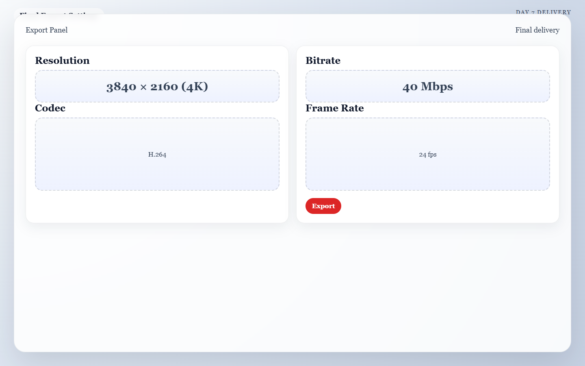

??? abstract "Meta: Page Purpose & Maintenance (For Agents & Instructors)"
    **Purpose:** This page teaches Day 7 of the AI Director Course: final review and polish. It exists to help learners evaluate their work against the original blueprint, improve the final presentation, and export a strong finished piece.
    
    **Maintenance Instructions:** Update this page when export guidance, self-critique framework, or finishing workflow changes. Keep the guidance grounded in practical completion and honest review, not endless tweaking.

# Day 7: The Premiere

!!! success "Today's Mission"
    Export a polished final video and evaluate it against your original Day 1 vision. By the end of today, you will have a finished, shareable cinematic short and a repeatable workflow you can use for your next project.

## What You Need Before You Start
* **Your Rough Cut:** The near-final editing timeline from Day 6.
* **Your Blueprint:** The Day 1 storyboard and project goal to keep you grounded.
* **An Upscaler (Optional):** A tool to boost resolution (like CapCut's built-in enhancer or Topaz Video AI).
* **Distance:** Enough mental distance to judge the piece honestly as a viewer, not an editor.

---

## 🏃‍♂️ The Fast Track

If you are ready to cross the finish line, follow these steps to polish and export your video.

### Step 1 — Review Without Touching the Timeline
Watch the piece from start to finish once as a viewer, not an editor. Take your hands off the keyboard. Just watch it, and take notes on what bumps you out of the experience.

### Step 2 — Compare Against the Blueprint
Check the finished piece against your Day 1 concept sentence. 
* Does the story read clearly?
* Did you hit the intended audience goal?
* Is the final payoff shot actually the strongest moment in the sequence?

### Step 3 — Make High-Value Final Fixes
Do not redesign the whole video today. Prioritize only changes that clearly improve the piece:
* Tighten the opening hook (get to the action faster).
* Smooth out any harsh audio transitions.
* Remove a visibly weak shot if it doesn't add to the story.

### Step 4 — The Upscale Pass (Wait Until the End!)
**Crucial Rule:** Upscale, sharpen, or export at a higher resolution *only* when the content itself is completely locked and approved. Use your editing software or a dedicated tool to take the video from 720p/1080p to a crisp 4K.

*Caption: A final export panel configured for a crisp 4K master so the finished piece is ready for publishing and archiving.*

### Step 5 — Export Deliberately
Create your final deliverables:
1. **The Master:** One high-quality ProRes or MP4 export at the highest resolution.
2. **The Social Export:** One version sized for the primary platform (e.g., vertical 9:16 for Reels/TikTok).
3. **The Archive:** A folder containing your final exports, your project file, and your winning text prompts so you have a cheat sheet for your next video.

---

## 🧠 The Deep Dive

Expand these sections to master the art of the self-critique and learn when to stop tweaking.

??? info "The Self-Critique Rule"
    Judge the work against the brief you set on Day 1, not against every possible multi-million dollar film on the internet. A successful result is not perfect. A successful result is a finished short video that matches the intended goal and demonstrates your control over sequence and style.

??? info "How to decide whether to keep polishing"
    Ask yourself: *Will this next change make the piece meaningfully better for the viewer?* If the answer is no, stop editing.

??? warning "Troubleshooting: The piece still feels unfinished"
    Identify whether the problem is clarity, pacing, or polish. Do not try to solve all three at once. Fix clarity first, pacing second, and polish last.

??? warning "Troubleshooting: Upscaling makes the AI artifacts look worse"
    This happens frequently. AI upscalers add artificial sharpness, which can make a slightly warped face look like a terrifying monster in 4K. If the upscale ruins the image, discard it. Use the cleaner, softer base export instead.

??? warning "Troubleshooting: The final shot doesn't land"
    If the ending feels weak, replace the shot with a stronger alternate take from Day 3. If you don't have one, shorten the lead-in to the final shot so the ending arrives with more abrupt impact.

---

## ✅ The Final Checkpoint

Before declaring the sprint complete, confirm that:

- [ ] The message or mood is clear.
- [ ] The sound supports the visuals.
- [ ] The final file is exported and ready to publish.
- [ ] You have archived your prompts for reuse.

!!! quote "Mini Assignment: The 3-Line Postmortem"
    Write down a quick three-line review for yourself:
    1. What worked best?
    2. What failed most often?
    3. What will you change in the next sprint?

**Congratulations, Director.** You now have a complete AI-directed video project and a repeatable workflow you can use again with better speed and taste.